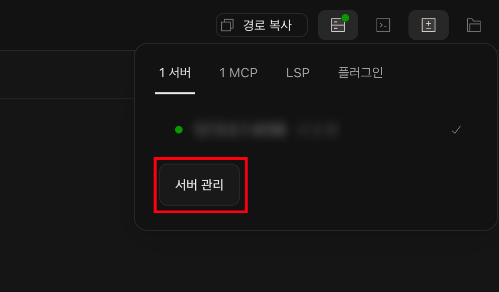
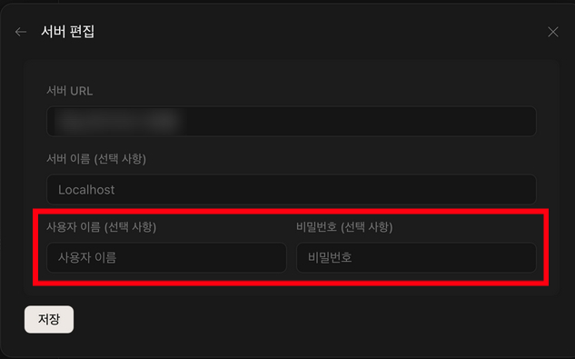

# opencode-web-hosting
Docker and docker-compose configuration for self-hosting the OpenCode web interface in a container.

## Prerequisites

- Docker 20.10 or newer
- Docker Compose plugin (v2+) or the standalone `docker compose` command
- A terminal with permission to run Docker (root, sudo, or Docker group membership)

## Quick start

1. Clone this repository (replace `<repo-url>` with the canonical URL or SSH path) and move into it:
   ```sh
   git clone <repo-url>
   cd opencode-web-hosting
   ```
2. Copy the example environment file, open it in your editor, and give every variable a secure value:
   ```sh
   cp .env.example .env
   vim .env
   chmod 600 .env
   ```
3. Run the helper to carve directories, sync ownership, and launch the stack:
   ```sh
   chmod u+x setup.sh
   ./setup.sh
   ```

The script creates `workspace/` and `opencode-home/`, writes your current UID/GID into `.env`, secures the file, and starts the docker-compose stack in detached mode.

## Environment variables

| Variable | Purpose | Default | Notes |
| --- | --- | --- | --- |
| `PORT` | Host port forwarded to OpenCode’s internal `4096` | `4096` | If you need to run multiple instances, change this value before running `setup.sh`. |
| `NODE_PASSWORD` | Linux password for the `node` user inside the container | `yourpassword` | This password is required for elevated actions inside the container (e.g., `sudo`). Keep it hard to guess. |
| `OPENCODE_USERNAME` / `OPENCODE_PASSWORD` | Credentials pushed into OpenCode server settings via Docker env vars | `opencode` / `verylonganddifficultpassword` | Also add the same pair inside the OpenCode Settings > Server Settings panel; the upstream UI currently re-prompts for authentication without them. |
| `UID` / `GID` | Host owner identifiers injected by `setup.sh` | `1000` / `1000` | Avoid rewriting these manually unless you understand how it affects file ownership in `workspace/`. |

## How it works

- The Dockerfile builds from `node:bookworm-slim`, installs tooling, installs `opencode-ai` globally, and exposes port `4096`.
- The image runs as the `node` user after remapping UID/GID to the values exported in `.env`, so mounted volumes stay writable without requiring root.
- `docker-compose.yml` uses `.env` to fill ports, UID/GID, and OpenCode credentials, and mounts two host folders for persistent data.
- `docker-entrypoint.sh` prepares the home directory and delegates to `opencode web --hostname 0.0.0.0 --port 4096` through `tini`.
- It mirrors your host UID/GID.

Once the container is running, visit `http://localhost:${PORT:-4096}` and log in with the username/password from your `.env`.




Because the web UI currently hits a little? bug that keeps asking for auth, open **Server Settings** and manually copy the same username/password into the form.

## Caution

For safety even during personal experimentation, sit the service behind HTTPS (for example, via Traefik, Caddy, or nginx) and route access through your VPN/firewall so only authorized clients can reach the OpenCode instance.